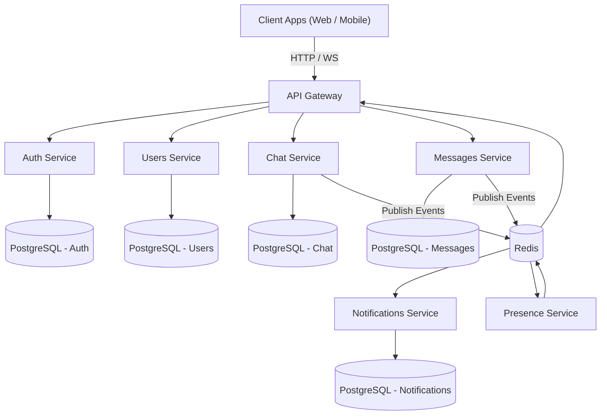
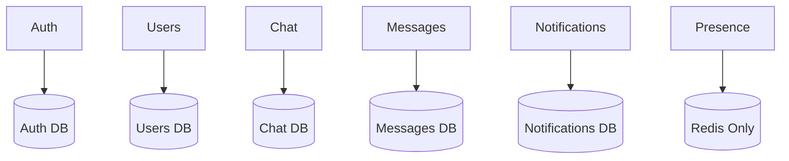
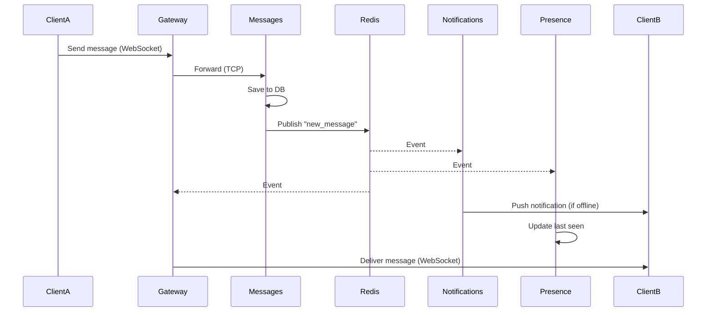

# whatsapp-clone
#Real-time messaging between two users over WebSocket with Redis pub/sub in the #middle. That is genuinely impressive work.


PROJECT STRUCTURE

 ```mermaid
 flowchart TD
    Root[whatsapp-clone]

    Apps[apps]
    Libs[libs]

    Root --> Apps
    Root --> Libs

    Apps --> Gateway
    Apps --> Auth
    Apps --> Users
    Apps --> Chat
    Apps --> Messages
    Apps --> Notifications
    Apps --> Presence

    Libs --> Common
    Libs --> Database
    Libs --> Redis
```

DATABASE STRATEGY


COMMUNICATION PATTERN

```mermaid
flowchart TD
    Client["Client Apps"]

    Gateway["API Gateway"]

    Auth["Auth"]
    Users["Users"]
    Chat["Chat"]
    Messages["Messages"]
    Notifications["Notifications"]
    Presence["Presence"]

    DB1[("Auth DB")]
    DB2[("Users DB")]
    DB3[("Chat DB")]
    DB4[("Messages DB")]
    DB5[("Notifications DB")]
    Redis[("Redis")]

    Client --> Gateway

    Gateway --> Auth
    Gateway --> Users
    Gateway --> Chat
    Gateway --> Messages

    Auth --> DB1
    Users --> DB2
    Chat --> DB3
    Messages --> DB4
    Notifications --> DB5

    Messages --> Redis
    Chat --> Redis

    Redis --> Notifications
    Redis --> Presence
    Redis --> Gateway

    %% Styles
    classDef gateway stroke:#fb923c,fill:#fff7ed,color:#1e1b4b
    classDef service stroke:#818cf8,fill:#eef2ff,color:#1e1b4b
    classDef async stroke:#2dd4bf,fill:#f0fdfa,color:#1e1b4b
    classDef db stroke:#94a3b8,fill:#f8fafc,color:#1e1b4b

    class Gateway gateway
    class Auth,Users,Chat,Messages service
    class Notifications,Presence async
    class DB1,DB2,DB3,DB4,DB5,Redis db
```mermaid
flowchart TD
    Client["Client Apps"]

    Gateway["API Gateway"]

    Auth["Auth"]
    Users["Users"]
    Chat["Chat"]
    Messages["Messages"]
    Notifications["Notifications"]
    Presence["Presence"]

    DB1[("Auth DB")]
    DB2[("Users DB")]
    DB3[("Chat DB")]
    DB4[("Messages DB")]
    DB5[("Notifications DB")]
    Redis[("Redis")]

    Client --> Gateway

    Gateway --> Auth
    Gateway --> Users
    Gateway --> Chat
    Gateway --> Messages

    Auth --> DB1
    Users --> DB2
    Chat --> DB3
    Messages --> DB4
    Notifications --> DB5

    Messages --> Redis
    Chat --> Redis

    Redis --> Notifications
    Redis --> Presence
    Redis --> Gateway

    %% Styles
    classDef gateway stroke:#fb923c,fill:#fff7ed,color:#1e1b4b
    classDef service stroke:#818cf8,fill:#eef2ff,color:#1e1b4b
    classDef async stroke:#2dd4bf,fill:#f0fdfa,color:#1e1b4b
    classDef db stroke:#94a3b8,fill:#f8fafc,color:#1e1b4b

    class Gateway gateway
    class Auth,Users,Chat,Messages service
    class Notifications,Presence async
    class DB1,DB2,DB3,DB4,DB5,Redis db
```
```

REAL-TIME MESSAGE FLOW


